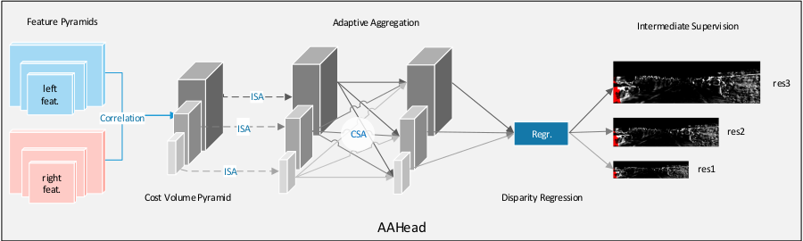
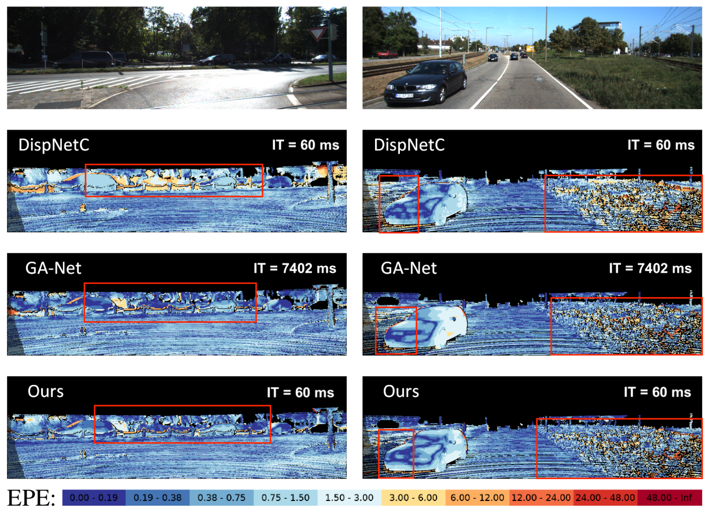

# AANet-MS

A PyTorch implementation of iterative coarse-to-fine refinement algorithm (iCFR) on improved **[AANet](https://arxiv.org/abs/2004.09548)**, [CVPR 2020](http://cvpr2020.thecvf.com/) : 
<p align="center"></p>

## Highlights

- **iCFR Algorithm**
  As described in our paper: *Multi-scale Iterative Residuals for Fast and Scalable Stereo Matching*.

- **Modular design**
  
  We decompose the end-to-end stereo matching framework into five components: 

  **feature extraction**, **cost volume construction**, **cost aggregation**, **disparity computation** and **disparity refinement.** 

  We combine the **cost volume construction**, **cost aggregation**, **disparity computation** into a supermodule named **Prediction Head**.

- **High efficiency**

  Our method can run at **60ms** for a KITTI stereo pair (384x1248 resolution).

- **Full framework**

  All codes for training, validating, evaluating, inferencing and predicting on any stereo pair are provided. Prediction Head can be adopted by any state of the art stereo estimation model. 

## Installation

Our code is based on PyTorch 1.7.0, CUDA 10.2 and python 3.7. 

We recommend using [conda](https://www.anaconda.com/distribution/) for installation: 

```shell
conda env create -f environment.yml
```

After installing dependencies, build deformable convolution:

```shell
cd nets/deform_conv && bash build.sh
```

## Dataset Preparation

Download [Scene Flow](https://lmb.informatik.uni-freiburg.de/resources/datasets/SceneFlowDatasets.en.html), [KITTI 2012](http://www.cvlibs.net/datasets/kitti/eval_stereo_flow.php?benchmark=stereo) and [KITTI 2015](http://www.cvlibs.net/datasets/kitti/eval_scene_flow.php?benchmark=stereo) datasets. 

Our folder structure is as follows:

```
data
├── KITTI
│   ├── kitti2012
│   │   └── raw
│   ├── kitti2015
│   │   └── raw
└── SceneFlow
    ├── Driving
    │   ├── raw
    │   │   ├── disparity
    │   │   └── frames_finalpass
    ├── FlyingThings3D
    │   ├── raw
    │   │   ├── disparity
    │   │   └── frames_finalpass
    └── Monkaa
        ├── raw
            ├── disparity
            └── frames_finalpass
```

If you would like to use the pseudo ground truth supervision introduced in our paper (in review at WACV 2022), you can download the pre-computed disparity on KITTI 2012 and KITTI 2015 training set here: [KITTI 2012](https://drive.google.com/open?id=1ZJhraqgY1sL4UfHBrVojttCbvNAXfdj0), [KITTI 2015](https://drive.google.com/open?id=14NGQp9CwIVNAK8ZQ6GSNeGraFGtVGOce). 

For KITTI 2012, you should place the unzipped file `disp_occ_pseudo_gt` under `kitti_2012/data_stereo_flow/training` directory. 

For KITTI 2015, you should place `disp_occ_0_pseudo_gt` under `kitti_2015/data_scene_flow/training`.

It is recommended to symlink your dataset root to `$AANet-MS/data`:

```shell
ln -s $YOUR_DATASET_ROOT data
```

Otherwise, you may need to change the corresponding paths in the scripts.

## Model Zoo

Final pretrained models are available in the model zoo:

    /netscratch/kraza/aanet+/ModelZoo/AANet-MS/*

We assume the downloaded weights are located under the `pretrained` directory. 

Otherwise, you may need to change the corresponding paths in the scripts.

## Inference

To generate prediction results on the test set of Scene Flow and KITTI dataset, you can run [scripts/aanet+_inference.sh](scripts/aanet+_inference.sh).

## Prediction

For prediction on any rectified stereo pairs. [scripts/aanet+_predict.sh](scripts/aanet+_predict.sh) provides an example usage.

## Running

All training, evaluation, prediction, profiling, inference scripts on Scene Flow and KITTI datasets are provided in [scripts/aanet+_train.sh](scripts/aanet+_train.sh).
Revise the parameters as required and the run it directly for local training.
- For running on **Slurm Cluster** use the [run_slurm.sh](run_slurm.sh) script after revising the required **srun** arguments in it. 

Note that we use 4 NVIDIA V100 GPUs (32G) with batch size 64 for training, you may need to tune the batch size according to your hardware. 

We support using tensorboard/wandb to monitor and visualize the training process. To use 'wandb', please enable logging by setting '**--wandb 1**' in the training scripts and setting the **--wbProj** and **--wbRunName** argument accordingly. For monitoring on cluster WANDB_API_KEY needs to be set accordingly in [run_slurm.sh](run_slurm.sh).

- **How to train on my own data?**

  You can first generate a filename list by creating a data reading function in [filenames/generate_filenames.py](filenames/generate_filenames.py) (an example on KITTI dataset is provided), and then create a new dataset dictionary in [dataloader/dataloader.py](dataloader/dataloader.py).

- **How to develop new components?**

  Our framework is flexible to develop new components, e.g., new feature extractor, cost aggregation module or refinement architecture. You can 1) create a new file (e.g., `my_aggregation.py`) under `nets` directory, 2) import the module in `nets/aanet.py` and 3) use it in the model definition.

## Evaluation

To enable fast experimenting, evaluation runs on-the-fly without saving the intermediate results. 

We provide two types of evaluation setting:

- After training, evaluate the model with best validation results
- Evaluate a pretrained model

Check [scripts/aanet+_evaluate.sh](scripts/aanet+_evaluate.sh) for an example usage.

## Results
#### Evaluations and Comparisons on SceneFlow Dataset (30 epoches)
|Models|3D conv layers|GA layers |Avg. EPE (pixel)|1-pixel Error rate (%)|Inference Time (ms)|
|---|---|---|---|---|---|
|GC-Net|19|-|1.8|15.6|950|
|PSMNet|35|-|1.09|12.1|640|
|GANet-15|15|5|0.84|9.9|_|
|GANet-deep|22|9|0.78|8.7|7402|
|FRSNet-GA|21|10|0.93|17.5|150|
|AANet-MS|-|-|0.98|16.9|60|


#### Evaluations on KITTI 2012 benchmark
| Models | Non-Occluded	| All Area |
|---|---|---|
| [GC-Net](http://www.cvlibs.net/datasets/kitti/eval_stereo_flow_detail.php?benchmark=stereo&error=3&eval=all&result=8da072a8f49d792632b8940582d5578c7d86b747)| 1.77	| 2.30 |
| [PSMNet](http://www.cvlibs.net/datasets/kitti/eval_stereo_flow_detail.php?benchmark=stereo&error=3&eval=all&result=8da072a8f49d792632b8940582d5578c7d86b747) | 1.49	| 1.89 |
| [GANet-15](http://www.cvlibs.net/datasets/kitti/eval_stereo_flow_detail.php?benchmark=stereo&error=3&eval=all&result=b2d616a45b7b7bda1cb9d1fd834b5d7c70e9f4cc) | 1.36 | 1.80 |
| [GANet-deep](http://www.cvlibs.net/datasets/kitti/eval_stereo_flow_detail.php?benchmark=stereo&error=3&eval=all&result=95af4a21253204c14e9dc7ab8beb9d9b114cfb9d) | 1.19 | 1.60 |
| AANet-MS | 1.92 | 2.70 |
#### Evaluations on KITTI 2015 benchmark

| Models | Non-Occluded	| All Area | Inference Time (ms) |
|---|---|---|---|
| [GC-Net](http://www.cvlibs.net/datasets/kitti/eval_scene_flow_detail.php?benchmark=stereo&result=70b339586af7c573b33a4dad14ea4a7689dc9305) | 2.61 | 2.87 |900|
| [PSMNet](http://www.cvlibs.net/datasets/kitti/eval_scene_flow_detail.php?benchmark=stereo&result=efb9db97938e12a20b9c95ce593f633dd63a2744) | 2.14 | 2.32 |410|
| [GANet-15](http://www.cvlibs.net/datasets/kitti/eval_scene_flow_detail.php?benchmark=stereo&result=59cfbc4149e979b63b961f9daa3aa2bae021eff3) | 1.73 | 1.93 |-|
| [GANet-deep](http://www.cvlibs.net/datasets/kitti/eval_scene_flow_detail.php?benchmark=stereo&result=ccb2b24d3e08ec968368f85a4eeab8b668e70b8c) | 1.63 | 1.81 |1800|
| FRSNet-GA | 2.1 | 2.80 | 150 |
| AANet-MS | 1.88 | 2.09 | 60 |


## Results KITTI 2015:



## Acknowledgements

Part of the code is adopted from previous works: [AANet](https://github.com/haofeixu/aanet), [PSMNet](https://github.com/JiaRenChang/PSMNet), [GwcNet](https://github.com/xy-guo/GwcNet) and [GA-Net](https://github.com/feihuzhang/GANet). We thank the original authors for their awesome repos. The deformable convolution op is taken from [mmdetection](https://github.com/open-mmlab/mmdetection). The FLOPs counting code is modified from [pytorch-OpCounter](https://github.com/Lyken17/pytorch-OpCounter). The code structure is partially inspired by [mmdetection](https://github.com/open-mmlab/mmdetection).


